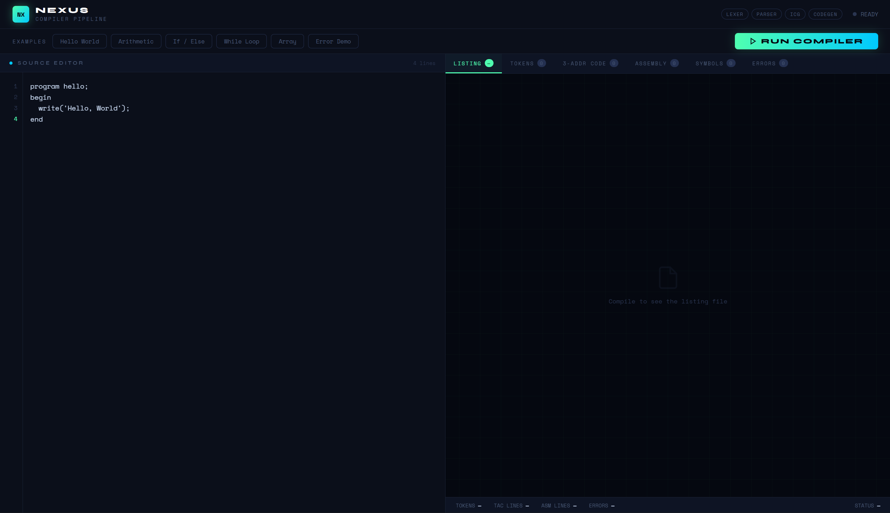
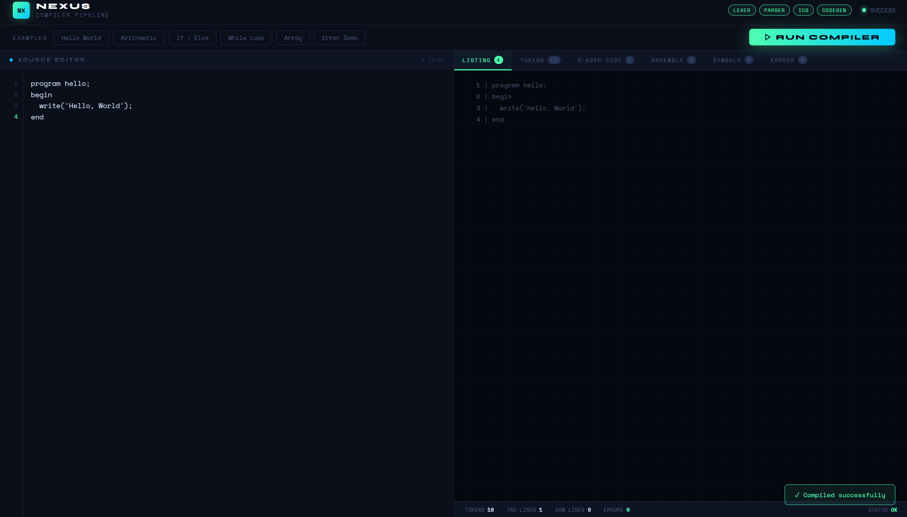
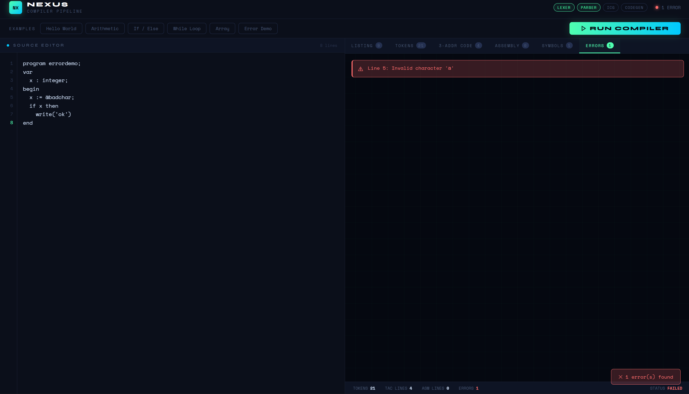

<h1 align="center">⚙️ NEXUS Compiler Pipeline</h1>

<p align="center">
  <b>A complete four-stage compiler for a Pascal-like Domain-Specific Language (DSL), built in Python.</b>
</p>

<p align="center">
  A browser-based compiler that performs <b>lexical analysis</b>,
  <b>recursive descent parsing</b>, <b>three-address code generation</b>,
  and <b>pseudo x86 assembly generation</b>.
</p>

<p align="center">
  🚀 <b>Live Demo</b>
</p>

<p align="center">
  🌐 <a href="https://nexuscompiler.vercel.app/"><b>Try NEXUS Compiler</b></a>
</p>

<p align="center">
  
  
  
  
  
  
</p>

---

## 📌 Overview

**NEXUS Compiler Pipeline** is a complete four-stage compiler for a Pascal-like Domain-Specific Language (DSL), built entirely from scratch in Python — **without Lex/Yacc or ANTLR**.

NEXUS translates source code through the complete compilation pipeline:

```text
Source Code → Lexer → Tokens → Parser → TAC (IR) → CodeGen → Pseudo x86 Assembly
```

## Screenshots

**Main interface — source editor with example programs**


**Compilation output — tokens, TAC, and assembly tabs**


**Error detection and listing view**


## Features

- **Hand-written lexer** — finite-automaton-style scanner supporting 5 token classes, inline comments (`!`), string escape sequences (`\n`, `\t`), and 4 distinct error types with line-numbered reporting
- **Recursive descent parser** — supports 6 statement types, full operator precedence (relational → additive → multiplicative → unary), and error recovery that reports multiple errors per run instead of halting on the first
- **Three-address code (TAC) generation** — automatic temporary variable allocation, label-based control flow for `if/else` and `while`, and array load/store instructions
- **Symbol table** — case-insensitive identifier tracking with support for integer and array types
- **Pseudo x86 assembly backend** — 14 TAC-to-assembly instruction mappings with a 4-register allocation model (`EAX`, `EBX`, `ECX`, `EDX`)
- **Listing file generator** — annotated source with inline, line-numbered error markers
- **Live web UI** — single-page app (vanilla HTML/CSS/JS) with 6 output tabs (Listing, Tokens, TAC, Assembly, Symbols, Errors), 6 built-in example programs, and a real-time stats bar

## Language Support

The NEXUS DSL is a Pascal-like, statically typed, block-structured language:

- Integer and string variables, one-dimensional integer arrays
- Arithmetic and relational expressions (`+ - * / and or not < > = <> <= >=`)
- Control flow: `if/then/else`, `while/do`
- I/O: `read(...)`, `write(...)`
- Block structure: `program ... var ... begin ... end`

```pascal
program arithmetic;
var
  a : integer;
  b : integer;
  result : integer;
begin
  read(a);
  read(b);
  result := a + b * 2;
  write(result);
end
```

Full grammar is defined in BNF — see [`docs/grammar.md`](docs/grammar.md) *(or the project report, if included in this repo)*.

## Architecture

```
Browser (index.html)
   │  HTTP POST /compile (JSON)
   ▼
Flask Server (app.py)
   │  Python function call
   ▼
Compiler Engine (compiler_logic.py)
   Lexer → tokens[]
   Parser → TAC[], symbol_table, errors[]
   CodeGen → assembly[]
```

| File | Layer | Responsibility |
|---|---|---|
| `compiler_logic.py` | Compiler Engine | `Lexer`, `Parser`, `SymbolTable`, `CodeGen` classes + `run_compiler()` entry point |
| `app.py` | Web Server | Flask routes: `GET /` (serves UI), `POST /compile` (runs compiler, returns JSON) |
| `templates/index.html` | Frontend | Editor, tabs, token table, TAC/ASM viewers, error panel, stats bar |

## Getting Started

### Prerequisites
- Python 3.x
- Flask (`pip install flask`)

### Run locally

```bash
git clone https://github.com/Krish2600/nexus-compiler.git
cd nexus-compiler
pip install -r requirements.txt
python app.py
```

Then open `http://127.0.0.1:5000` in your browser, pick an example program (or write your own), and click **Run Compiler**.

## Example: TAC Generation

**Input:** `result := a + b * 2`

**Generated TAC:**
```
t1 = b * 2
t2 = a + t1
result = t2
```

**Generated Assembly (excerpt):**
```asm
; result = a + t1
MOV EAX, a
ADD EAX, t1
MOV [result], EAX
```

## Testing

The compiler has been validated against 14 test cases covering arithmetic expressions, nested `if/else`, `while` loops, array read/write, multi-variable declarations, and error conditions (invalid characters, unclosed strings, oversized identifiers, missing `begin`). Error recovery is verified by confirming the compiler continues parsing and produces partial TAC even after encountering lexical errors.

## Limitations & Future Work

NEXUS is a pedagogical compiler and intentionally does not support floating-point types, nested functions, or linking; generated assembly is illustrative pseudo-x86, not directly assemblable. Planned extensions include:

- An explicit AST (currently TAC is emitted directly during parsing)
- A semantic analysis pass (type checking, use-before-declaration checks)
- TAC optimizations (constant folding, dead code elimination)
- Real NASM-compatible codegen with proper register allocation
- `for` loops, multi-dimensional arrays, and user-defined procedures

## References

- Aho, Lam, Sethi, Ullman — *Compilers: Principles, Techniques, and Tools* (2nd ed.)
- Cooper & Torczon — *Engineering a Compiler* (2nd ed.)
- Wirth, N. (1971) — *The Programming Language Pascal*

## Author

**Krish Sharma** ([@Krish2600](https://github.com/Krish2600))
Built as a Compiler Design coursework project, 2025.
